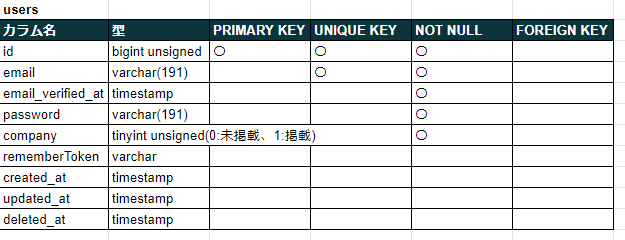
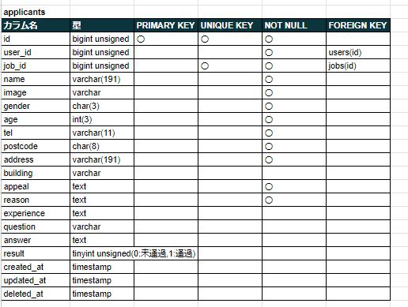
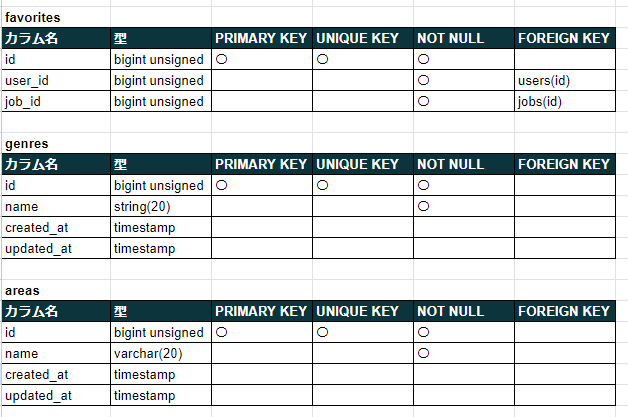
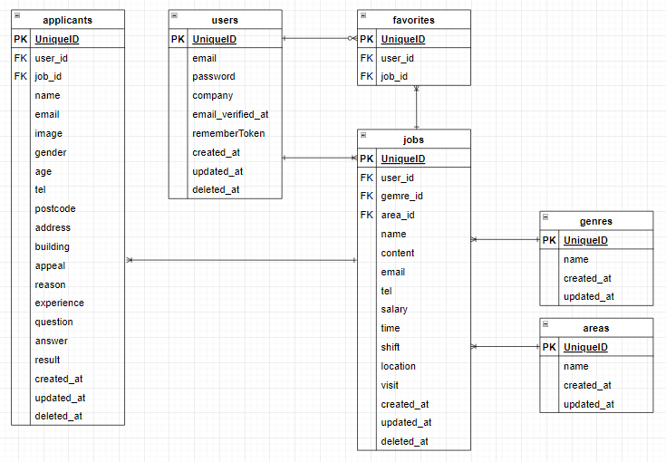

## アプリケーション情報

■ アプリケーション名 
・JOG 

■ プロダクト概要 
簡易版アルバイト求人サイト 
東京23区を対象とした、企業が求人を投稿し、ユーザーが閲覧して興味のある企業に応募する(多くの求人を求める企業が使用) 

■ トップ画像 

## アプリケーション URL
https://waterfall32-breeze.com/

## 使用技術(実行環境)
■ 使用言語 
HTML 
CSS 
JavaScript 
PHP 8.1.2 

■ 使用フレームワーク 
Laravel Framework 10.28.0 

■ 認証スターターキット 
未使用 

■ メール認証 
Mailpit(local環境) 

## 機能一覧
新規登録 
ログイン 
メール認証 
パスワード変更(パスワード忘れ時) 
求人一覧表示 
求人検索 
求人のお気に入り登録 
求人のお気に入り登録解除 
求人詳細表示 
求人へ応募 
応募結果表示 
ログインユーザー訪問件数表示 
応募件数表示 
応募一覧表示 
応募詳細表示 
求人新規追加 
求人詳細表示(企業側) 
求人詳細変更 

## テーブル設計

## ER 図

## 画面遷移図

## 環境構築
■ 開発環境 
[土台] 
Docker(Laravel Sail) 
LinuxOS 
[操作] 
ubuntu 
VSCode 
[サーバー] 
nginx 
[データベース] 
mysql 
[管理] 
Git 
GitHub 

## その他
■ ログイン用ダミーデータ 
[企業側ユーザー] 
・5件 
・メールアドレス：test1@test.com～test5@test.com 
・パスワード　　：test1111(共通) 

[一般ユーザー] 
・2件 
・メールアドレス：test6@test.com～test7@test.com 
・パスワード　　：test1111(共通) 
